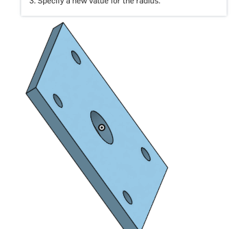
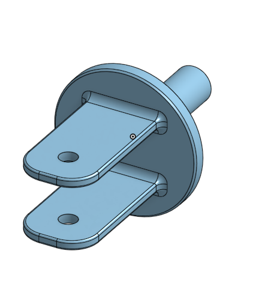
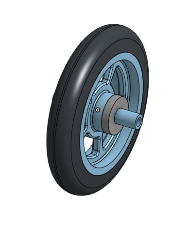
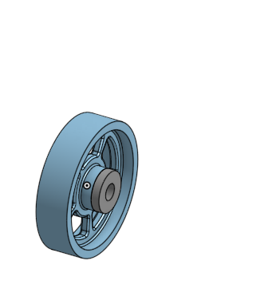
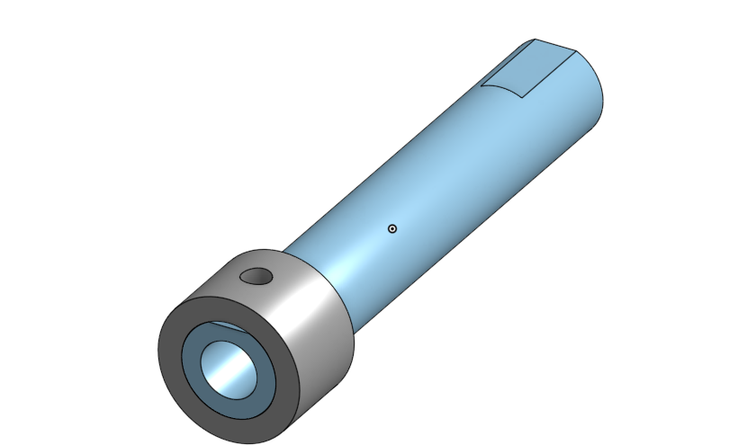

# BasicCAD

We are creating a caster.

---
## Table of Contents
* [Table of Contents](#Table-of-Contents)
* [Base](#Base)
* [Mount](#Mount)
* [Fork](#Fork)
* [Tire](#Tire)
* [Wheel](#Wheel)
* [AxleCollarBearings](#AxleCollarBearings)

## Base

### Description

The first assignment is to create the caster base.  The base's dimensions are 200 mm x 120 mm and 8 mm thick.  It has 6 holes 10 mm wide and 20 mm from the edge equally spaced along the edges.

### Evidence
[The Base in Onshape](https://cvilleschools.onshape.com/documents/0d70f655203ca304cb3c5b7d/w/f55603f962f6fc74f5548a68/e/41d730c570a8d75fce9f51b6)

### Image

### Reflection

This was my first Onshape part and [following along with Dr. Shields made it super easy.](https://www.youtube.com/watch?v=93BFUD-HAG8&feature=emb_title&scrlybrkr=5670f0b4)  I learned about 
* sketching (shortcut **shift-s**)
* constructions lines (shortcut **Q**)
* dimensions (shortcut **D**)
* extruding both add and remove (shortcut key **E**)
* linear patterns (no shortcut)

Onshape is awesome.  I found it really helpful to rename all my sketches.  It is going to be a GREAT year in engineering.

---

## Mount

### Description 
the mount is the second part of this castor project.

### Evidence
the evidecce is down below
### Image

### Reflection
it was really fun buildig it

---

## Fork

### Description
the fork is basically a fork

### Evidence
the evidence is down below
### Image 

### Reflection
It was very challenging but i manage to finish it.

---

## Tire

### Description
the tire is a tire

### Evidence
the evidence is down below

### Image

### Reflection
the tire was a fun one because of the the changes i had to make and it was really hard.

---

## Wheel

### Description
the wheel is a wheel

### Evidence
the evidence is down below
### Image

### Reflection
the wheel was challenging but I also had fun with it

---

## AxleCollarBearings

### Description
This assignment waas 3 parts in one vid

### Evidence
the evidence is down below

### Image

### Reflection
It was very easy

---

